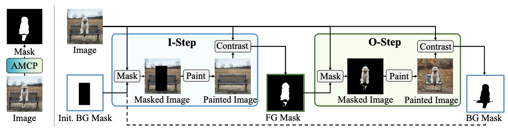

<font color="red">We build a Segment Anything Model (SAM) with Stable Diffusion Inpainting without any training!</font>

# Abstract
<!--  -->
The paper introduces PaintSeg, a new unsupervised method for segmenting objects without any training. We propose an adversarial masked contrastive painting (AMCP) process, which creates a contrast between the original image and a painted image in which a masked area is painted using off-the-shelf generative models. During the painting process, inpainting and outpainting are alternated, with the former masking the foreground and filling in the background, and the latter masking the background while recovering the missing part of the foreground object. Inpainting and outpainting, also referred to as I-step and O-step, allow our method to gradually advance the target segmentation mask toward the ground truth without supervision or training. PaintSeg can be configured to work with a variety of prompts, e.g. coarse masks, boxes, scribbles, and points. Our experimental results demonstrate that PaintSeg outperforms existing approaches in coarse mask-prompt, box-prompt, and point-prompt segmentation tasks, providing a training-free solution suitable for unsupervised segmentation.
<p align="center"></p>

> [**PaintSeg: Training-free Segmentation via Painting**](https://arxiv.org/abs/2305.19406)
>
> Xiang Li, Chung-Ching Lin, Yinpeng Chen, Zicheng Liu, Jinglu Wang, Bhiksha Raj

# Updates
- **(2023-11)** Demo released!
- **(2023-09)** PaintSeg is accepted to NeurIPS 2023!


## Environment setup
```
conda env create -f environment.yaml
conda activate PaintSeg
pip install -e git+https://github.com/CompVis/taming-transformers.git@master#egg=taming-transformers
pip install --force-reinstall cython==0.29.36
pip install --no-build-isolation git+https://github.com/lucasb-eyer/pydensecrf.git
```
## Datasets
Download datasets and put them in the main folder.
ECSSD, DUTS, PASCAL VOC, COCO MVal, GrabCut, Berkeley, DAVIS.

## Run
```angular2html
python scripts/PaintSeg.py --outdir $outdir$ --iters $iter_num$ --steps $diffusion step$ --dataset $dataset$ 
```
## Citation
```
@inproceedings{li2023paintseg,
  title={PaintSeg: Painting Pixels for Training-free Segmentation},
  author={Li, Xiang and Lin, Chung-Ching and Chen, Yinpeng and Liu, Zicheng and Wang, Jinglu and Singh, Rita and Raj, Bhiksha},
  booktitle={Thirty-seventh Conference on Neural Information Processing Systems},
  year={2023}
}
```
